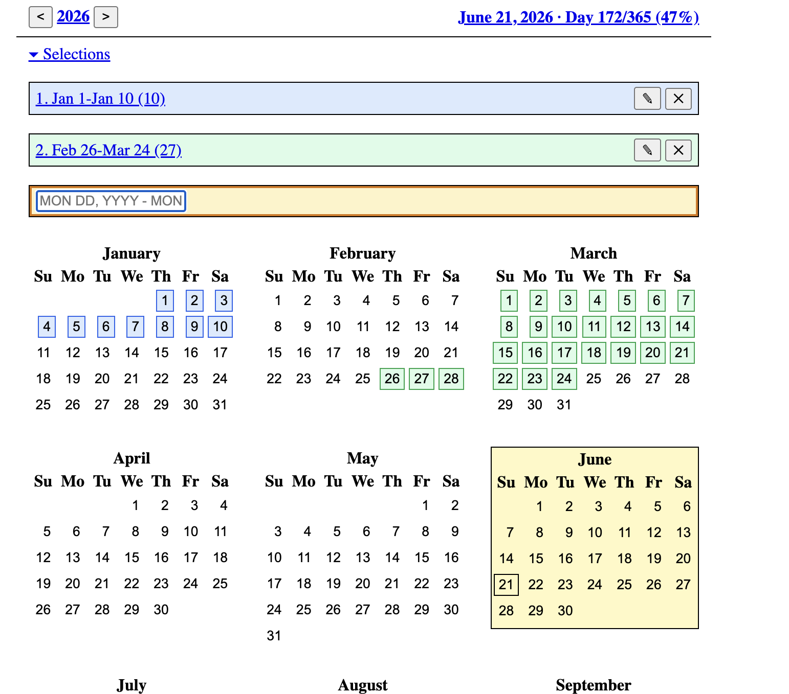

# cal

A plain JavaScript calendar app inspired by the Unix `cal` command.

Live site: [https://sri.github.io/cal/](https://sri.github.io/cal/)

## Features

- Full-year calendar view with Unix `cal` style month layout
- Multiple named date selections and date ranges
- Per-selection metadata functions such as duration, days since, days remaining, anniversary, and live counters
- Function-specific UI arguments, currently including anniversary `From` / `To` year controls
- Copy actions for metadata values
- Session-backed persistence with `sessionStorage`, so selections and selected functions survive page reloads in the current browser session

## Run locally

```bash
npm install
npm run dev
```

## Notes

- Built with plain JavaScript and Vite
- Selection state is stored in browser `sessionStorage`

## Screenshot


